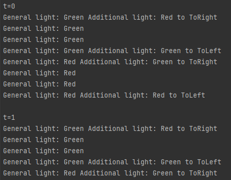

# Завдання №3

Результати аналізу роботи мого напарника Качинського Ігоря. Виконав Зозуля Ігор, команда №2.
Посилання на репозиторій напарника: https://github.com/igorkachynskyy/SSWU_Igor_Kachynskyy_NET_CAMP


# Характеристики оцінювання
## 1. Недоліки проєктування програми

Недолік який я помітив, це те, що створені світлофори, у межах одного перехрестя, не знають про стан інших, що в результаті може призвести до "аварійних ситувацій" при неправильно заданих значеннях таймінгів.  Більше, ніяких недоліків мною помічено не було, і в цілому програма відповідає заданим критеріям.

## 2. Відповідність реалізації програми реалізації.

Реалізація програми відповідає заданим критеріям:

| Завдання                                                                             | Результат |
|--------------------------------------------------------------------------------------|:---------:|
| Дороги, на перехресті можуть мати кілька смуг.                                       |     ✓     |
| Кожна смуга може мати свій світлофор, в тому числі, з світлом, який регулює поворот. |     ✓     |
| Перехресть, які контролюються симулятором може бути кілька.                          |     ✓     |


## 3. Недоліки реалізації.
Недоліки реалізації які я помітив:

1. Наявність enum Direction у файлі AdditionalSectionLight.cs, а не у окремому файлі.
2. Наявність enum State у файлі ITrafficLight.cs, а не у окремому файлі.
3.  Простенька і не досить зрозуміла реалізація інтерфейсу взаємодії з користувачем: 

## 4. Валідація даних.

Валідація данних у програмі є, в повному обсязі, і виконана належним чином. Приклад:
```
public State AdditionalState
    {
        get
        {
            return _additionalState;
        }
        set
        {
            if (value != State.Red && value != State.Green)
            {
                throw new Exception("Additional section doesn't have this state");
            }
	
            _additionalState = value;
        }
    }
```
## 5. Складність перебудови попередньої програми.

У процесі аналізу роботи простежується схожість з попередньою програмою, але також були внесені деякі зміни відповідно, до минулих зауважень. І я помітив,що програм зазнала прогресу, що до своєї можливості подальшого покращення. Отже, була виконана значна робота до перебудови прграми, але при цьому залишивши її основні моменти, я вважаю, що це було не легко.

# Висновок

Отже, результатом аналізу є те, що програма Качинського Ігоря, не зважаючи на деякі недоліки, виконана на високому рівні, з урахуванням усіх деталей, та особливостей реалізації. Також, хочу відмітити його гарний рівень комунікації та командної роботи.